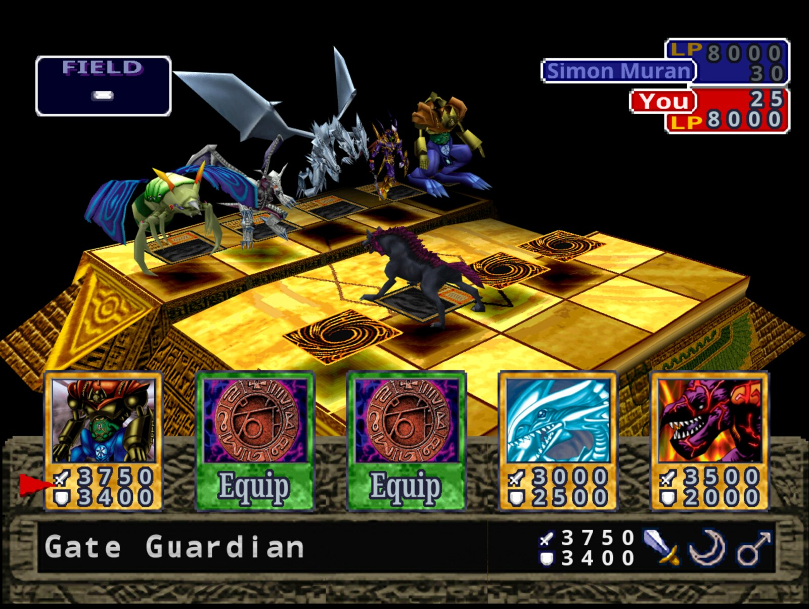
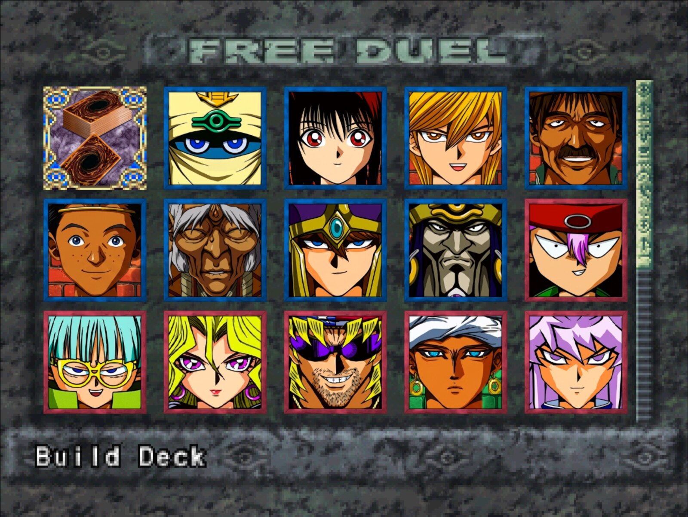

# Yu-Gi-Oh! Forbidden Memories Recompiled

**Yu-Gi-Oh! Forbidden Memories** (PS1, USA) rebuilt from its decompiled source as a
native PC game for Windows and Linux. Bring your own disc image; no game data is
included.



## Features

- Up to 4x internal resolution, widescreen and HD text
- **3D Monsters**: face-up monsters stand on the field as their battle models
- Optional **Forbidden Memories HD** pack: redrawn cards, frames and portraits
- Mods: new cards past the original 722, fusions, textures, music, gameplay tables
- Save slots, fusion helper, card drop rates, rebindable controls



## Play

Download the latest build from [Releases](https://github.com/Unchiga/Yu-Gi-Oh-Forbidden-Memories-Recompiled/releases),
extract it and run `memories-pc.exe` (Windows) or `./memories-pc` (Linux). On first
launch, pick your USA disc's `.bin`.

### HD pack

1. From the same release, download `yfm-redecomp-hd-mod-<version>.zip`.
2. Close the game and extract the zip into the game folder, the one with `memories-pc.exe`
   or `memories-pc`. You should end up with `mods/assets-hd` beside the other mods.
3. Start the game. The pack is on by default: press **F10** for the menu bar and open
   **Game > Mods** to check it, or to turn it or any of its parts off.
4. For the best look, pick **Video > Resolution > Internal 4x** and turn on **Video > HD text**.

**From source:** put the `.bin` in `game/` and run `play.bat` or `./play.sh`. The first
run builds everything (Linux needs `gcc` and `python3`). See [PC build](notes/pc-build.md).

## Decompilation

Every game function matches the original executable byte for byte:

```sh
make tools   # pinned toolchain
make match   # rebuild SLUS_014.11 exactly (see notes/setup.md)
```

<details>
<summary>Progress</summary>

<!-- BEGIN GENERATED PROGRESS -->

| Metric | Current |
|---|---:|
| Game C-decompilation targets matched | **1,134 / 1,134 (100.00%)** |
| Game C-decompilation target bytes matched | **356,080 (`0x56EF0`) / 356,080 (`0x56EF0`) (100.00%)** |
| Remaining game C-decompilation targets | 0 functions, 0 (`0x0`) |
| Evidence-backed handwritten game assembly | 61 functions, 40,116 (`0x9CB4`) |
| Total game-owned functions | 1,195 |
| Preserved Psy-Q CRT/SDK assembly | 591 functions, 117,348 (`0x1CA64`) |
| Total discovered functions | 1,786 |
| Embedded/unassigned resident text | 1,780 (`0x6F4`) |

Runtime overlay modules:

| Module | Matching C functions | Matching C bytes |
|---|---:|---:|
| `free_duel` | 9 / 9 (100.00%) | 4,140 (`0x102C`) / 4,140 (`0x102C`) (100.00%) |
| `main_menu` | 31 / 31 (100.00%) | 17,724 (`0x453C`) / 17,724 (`0x453C`) (100.00%) |
| `overworld_after_coup` | 15 / 15 (100.00%) | 6,184 (`0x1828`) / 6,184 (`0x1828`) (100.00%) |
| `overworld_before_coup` | 15 / 15 (100.00%) | 6,184 (`0x1828`) / 6,184 (`0x1828`) (100.00%) |
| `password` | 27 / 27 (100.00%) | 10,884 (`0x2A84`) / 10,884 (`0x2A84`) (100.00%) |

_Generated from `config/slus_01411/functions.csv` and `config/slus_01411/overlays/*_functions.csv` by `tools/project/progress.py`._

<!-- END GENERATED PROGRESS -->

</details>

## Docs

[Modding](notes/modding.md) · [More cards](notes/more-cards.md) · [Fusion helper](notes/fusion-helper.md) ·
[Card drops](notes/card-drops.md) · [Setup](notes/setup.md) · [Build](notes/build.md) · [Releases](notes/pc-release.md)

## Community

Join the [Discord](https://discord.gg/Gn6Mag52q) to follow development, ask questions
and report issues.

## License

The PC port (`src/pc/`, `tools/pc/`, `tests/pc/`, `mods/`, `examples/` and the build
and play scripts) is [MIT](LICENSE): keep the copyright notice and please link back
here. The decompilation builds on [memories-decomp](https://github.com/krystalgamer/memories-decomp)
by its authors. Yu-Gi-Oh! and Forbidden Memories belong to Konami.
